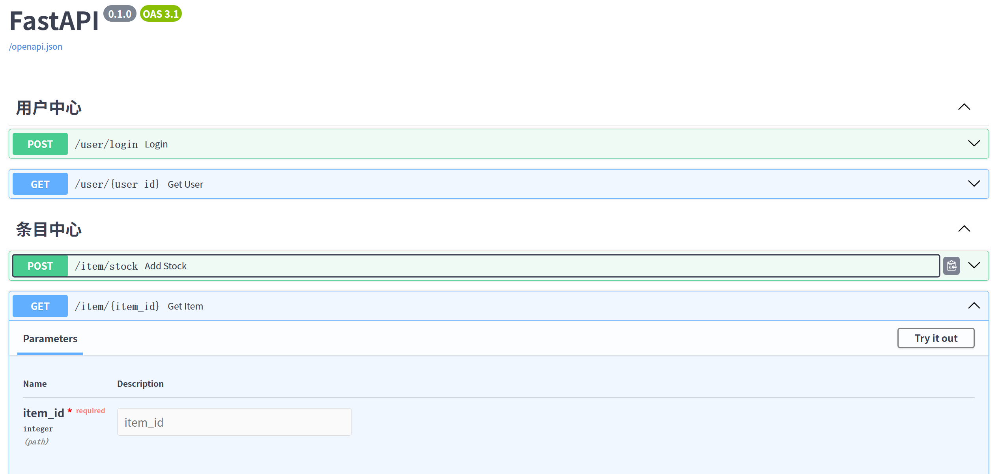
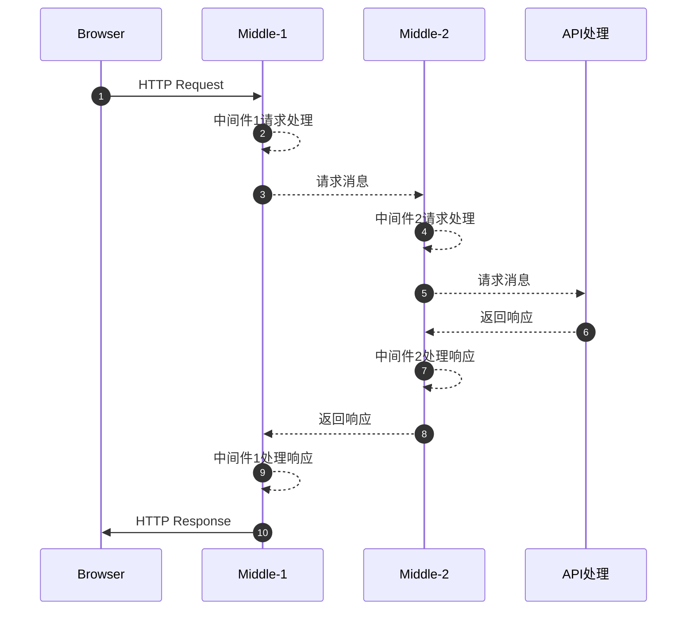

# `fastapi` 快速入门

## 安装依赖

以`uv`为例：

```shell
uv add fastapi
uv add uvicorn
uv add pydantic
# form表单依赖
uv add python-multipart
```

程序启动后，通过浏览器访问 `http://127.0.0.1:8080/docs` 即可实现类似`spring`的`swagger`功能。

## `Web` 实现范式

在讲`fastapi`前要讲述 `Web` 实现范式，能让你更容易理解`fastapi` 为什么是这样使用。

大多数的所谓的 `Web` 框架实际上都专注于业务的处理，而通用的`HTTP`通信和协议大多是由第三方组件完成，如`fastapi`使用的`uvicorn`,`Spring`使用的`tomcat`，这些组件都是可以被替换的。所以`fastapi`程序在启动的时候，也有几种方式：

- 在代码中通过`uvicorn`启动

```python
import uvicorn

if __name__ == '__main__':
    # 下面的 main 对应的是 入口的文件，即 main.py , app 对应的是 FastAPI 实例名
    uvicorn.run("main:app", reload=True, port=8080)
```

- 命令行中通过`uvicorn`启动

```shell
# 下面的 main 对应的是 入口的文件，即 main.py , app 对应的是 FastAPI 实例名
uvicorn main:app --reload
```

个人认为，除开通用的`HTTP`通信和协议外，一个最小的`Web` 框架应具备如下功能：

- 路由处理：定义`URL`及对应的处理函数
- 请求消息处理：包括请求行、消息头和请求数据，（通过注解等方式）自动提取到对应处理函数的参数中
- 响应消息构建：包括从数据库或缓存中获取数据，自动将返回数据结构转换成`HTTP`的响应消息体
- 中间件：流程拦截与处理，包括请求消息和响应消息的的拦截和处理

## 请求路由

`fastapi`通过注解简化了路由的配置（其实大多数的`Web` 框架都是如此），包括如下几种方式。

### 单个路由

通过`FastAPI`创建路由：

```python
from fastapi import FastAPI

app = FastAPI()

@app.get('/home')
async def root():
    return {'message': 'Hello, boy'}

@app.get("/hello/{item_name}")
def say_hello(item_name: str):
    return {"message": f"Hello, {item_name}"}

```

这种方式适合简单的demo演示，实际生产环境中`API`数量成千上万，写在一个文件里面不是一个好的实现方式。

### 按功能划分的路由

通过`APIRouter`来创建路由：

假设有一个用户相关的资源放在 `user/app.py`中：

```python
from fastapi import APIRouter

user = APIRouter()

@user.post('/login')
async def login(name: str, password: str):
    return {'token': 'abcDEF_121', "user": name}

@user.get("/{user_id}")
def get_user(user_id: int):
    return {"user": f"Hello, {user_id}"}
```

商品条目相关的资源放在 `item/app.py`中：

```python
from fastapi import APIRouter

item = APIRouter()

@item.post('/stock')
async def add_stock(name: str, number: int):
    return {'name': name, "number": number}

@item.get("/{item_id}")
def get_item(item_id: int):
    return {"items": item_id}
```

在`main.py`中：

```python
from fastapi import FastAPI
from user.app import user as user_app
from item.app import item as item_app
import uvicorn

app = FastAPI()

# 通过 include_router 将其它的路由引入
app.include_router(user_app, prefix="/user", tags=['用户中心'])
app.include_router(item_app, prefix="/item", tags=['条目中心'])

if __name__ == '__main__':
    uvicorn.run("main:app", reload=True, port=8080)
```

察看`http://127.0.0.1:8080/docs`页面信息如下：



## 请求消息

### 请求URL中的参数

- 动态路径

```python
app = FastAPI()

# 访问 /user/123 表示 user_id 值为 123
@app.get("/user/{user_id}")
def get_user(user_id: int):
    return {"user_id": user_id}
```

> **注意：**
>
> 如果存在两个路径：一个是静态路径 `/user/123` ，一个是动态路径 `/user/{user_id}`
> 那么，要将`/user/123`定义在前面，否则 `/user/123` 对应的路由不会被调用
> 因为 `URL` 匹配上路径后就直接调用该路径处理函数

- 查询参数

> 在函数中的参数，如果类型不是`pydantic`，也不是`fastapi`内置类型，那么就是普通参数。

普通将动态路径（如有）之后的所有key-value对作为函数的参数，如有默认值是可选参数。

```python
app = FastAPI()

# 访问 /filter?name=abc&age=123 表示 name 值为 abc, age 值为 123
@user.get("/filter")
def filter(name: str, age: int):
    return {"user": f"{name} age is: {age}"}

from typing import Union
# 访问 /filter2/abc?age=123，既有动态路径 name，又有查询参数 age, sex可选参数
@user.get("/filter2/{name}")
def filter(name: str, age: int, sex: Union[str, int]=0):
    return {"user": f"{name} age is: {age}"}
```

### 请求体内容

- `JSON`格式

`JSON`格式请求体依赖`pydantic`，该方式会对消息体进行对应的校验和转换，如果要做更多的控制，可以使用`Field`或`field_validator`注解校验函数。

```python
from typing import Union, List, Optional
from pydantic import BaseModel, Field, field_validator, ValidationError
from datetime import date


class User(BaseModel):
    name: str = Field(pattern="^a")  # 名字必须要以 a 开头
    age: int = Field(default=0, description="年龄", ge=0, lt=150)
    birth: Union[date, None] = None
    addr: str
    friends: List[int]
    tel: Optional[str] = None

    @field_validator("addr")
    def addr_validate(cls, value: str):
        assert value.startswith("中国"), '地址必须以中国开头'
        return value

# 组合嵌套
class Date(BaseModel):
    date: List[User]

user = APIRouter()

@user.post('/login')
async def login(user: User):
    return {'token': 'abcDEF_121', "user": user.name}

```

- `form`格式

`form`格式是`fastapi`自带的，只需要在参数变量中增加`Form()`即可。

```python
from fastapi import APIRouter, Form

item = APIRouter()

@item.post('/stock')
async def add_stock(name: str=Form(), number: int=Form()):
    return {'name': name, "number": number}
```

- `file`格式

上传文件主要使用`fastapi`自带 `File` 和 `UploadFile`这两个类型，优选`UploadFile`。

```python
from typing import List
from fastapi import APIRouter, File, UploadFile
import os

file = APIRouter()

@file.post("/file", description='上传单个文件')
async def get_file(data: bytes = File()):
    with open("1.docx", mode="wb") as f:
        f.write(data)
    return {'result': 'success'}

@file.post("/upload", description='上传单个文件')
async def upload(file: UploadFile):
    filename = os.path.join('upload', file.filename if file.filename is not None else '2.docx')

    with open(filename , mode="wb") as f:
        for line in file.file:
            f.write(line)
    return {'result': 'success'}

@file.post("/files", description='上传多个文件')
async def get_files(files: List[bytes] = File()):
    for file in files:
        print(len(file))
    return {'result': 'success'}
```

- `静态`文件

静态文件是指放置在指定目录下的图片、`HTML`、`CSS`、`JS`等文件（可以是多级路径），该文件可以通过`nginx`供浏览器读取，也可以通过`fastapi`提供。

```python
from fastapi import FastAPI
from fastapi.staticfiles import StaticFiles

app = FastAPI()
# 假设 statics 目录下有一个 index.html文件
# 可以通过  http://127.0.0.1:8080/static/index.html 访问
app.mount('/static', StaticFiles(directory='statics'))
```

### 请求头

请求头的数据通过`fastapi`的`Request`数据类型获取。

```python
from fastapi import APIRouter, Request

request = APIRouter()

@request.post('/req_item')
async def items(request: Request):
    return {
        'url': request.url,
        'client': request.client.host if request.client is not None else "unknown",
        'accept': request.headers.get('accept'),
        'agent': request.headers.get('user-agent'),
    }
```

## 响应消息

### 响应消息体

同样可以在`@app.get`等注解中对响应消息做一些限制，

```python
from fastapi import APIRouter
from typing import Union, List, Optional
from pydantic import BaseModel, Field, field_validator, ValidationError
from datetime import date
import hashlib


class User(BaseModel):
    name: str = Field(pattern="^a")  # 名字必须要以 a 开头
    age: int = Field(default=0, description="年龄", ge=0, lt=150)
    birth: Union[date, None] = None
    password: str
    friends: List[int]
    tel: Optional[str] = None

class UserLoginResponse(BaseModel):
    name: str
    token: Union[str, None] = None

user = APIRouter()

@user.post('/login', response_model=UserLoginResponse)
async def login(user: User):
    token = hashlib.md5(user.password.encode()).hexdigest()
    response = UserLoginResponse(name=user.name, token=token)
    return response
```

注解中的其它的一些参数如下：

- `response_model_exclude_unset` 参数：为`True`响应中将不会包含那些默认值，而是仅有实际设置的值
- `response_model_include` 参数：只包含某个字段，如`response_model_include={"name", "age"}` 用于结果只包含`name`和`age`字段
- `response_model_exclude` 参数：排除掉某个字段，如`response_model_exclude={"name"}` 用于排除`name`字段

## 中间件

中间件调用逻辑遵从先进后出顺序，如下图所示：



中间件使用`@app.middleware("http")`注解对应的函数，对应的代码如下：

```python
import time
from fastapi import FastAPI, Request, Response
from typing import Awaitable, Callable

app = FastAPI()

@app.middleware("http")
async def time_used(request: Request, call_next: Callable[[Request], Awaitable[Response]]) -> Response:
    print("call time_used")
    start_time = time.time()
    # 转发至下一个流程处理，直至返回最终响应
    response = await call_next(request)
    process_time = time.time() - start_time
    # 在响应消息加 "X-Process-Time" 头保存处理消息时间
    response.headers["X-Process-Time"] = str(process_time)
    print("end call time_used")
    return response


@app.middleware("http")
async def first_md(request: Request, call_next: Callable[[Request], Awaitable[Response]]) -> Response:
    print("call first_md")
    # 转发至下一个流程处理，直至返回最终响应
    response = await call_next(request)
    print("end call first_md")
    return response
```

程序调用任何一个API将打印信息如下：

```shell
call first_md
call time_used
end call time_used
end call first_md
```

### 跨域中间件 `CORSMiddleware`

```python
from fastapi import FastAPI
from fastapi.middleware.cors import CORSMiddleware

app = FastAPI()

# 只允许如下源访问
origins = [
    "http://localhost.tiangolo.com",
    "https://localhost.tiangolo.com",
    "http://localhost",
    "http://localhost:8080",
]

app.add_middleware(
    CORSMiddleware,
    allow_origins=origins,
    allow_credentials=True,
    allow_methods=["*"],
    allow_headers=["*"],
)


@app.get("/")
async def main():
    return {"message": "Hello World"}
```
